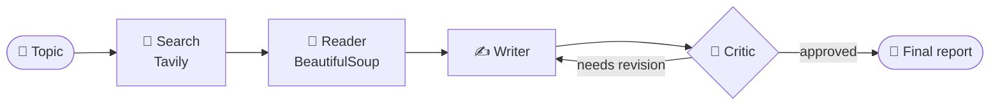

---

## 👋 About me

B.Tech CSE (AI specialization), Jamia Hamdard University, 2026. I work on **LLM post-training at Ethara AI** and spend my spare time building agentic AI systems.

| | |
|---|---|
| 🔭 **Building** | Multi-agent pipelines that research, write, and self-critique |
| 🧠 **Focus** | LLM agents, prompt engineering, LLM evaluation |
| 📍 **Based in** | Delhi NCR |
| 🎯 **Next** | Moving into an AI Engineer role |

---

## 🚀 Featured: MARS

**Multi-Agent AI Research System.** I built a 4-agent LangGraph pipeline that takes a topic and returns a researched, critiqued report. The Critic can send the draft back to the Writer until it passes review.

| Agent | What it does |
|:--|:--|
| 🔎 **Search** | Finds sources with Tavily |
| 📖 **Reader** | Extracts page content with BeautifulSoup |
| ✍️ **Writer** | Drafts the report |
| 🧐 **Critic** | Reviews it and sends revisions back |

**Stack:** LangGraph · LLaMA 3.1 (via Groq) · Tavily · BeautifulSoup · Streamlit

---

## 🧪 More things I built

<b>💳 Credit Card Fraud Detection</b>

 
I built an XGBoost + SMOTE model to handle heavily imbalanced transaction data, reaching 97%+ precision.

<b>🩺 Breast Cancer Prediction</b>

 
I built a classification model on clinical features.

<b>🎙️ VidSnapAI</b>

 
I built a Flask app that generates voiceovers with ElevenLabs.

---

## 🛠️ Tech stack

---

**Open to collaborating on agentic AI projects. Say hi 👇**

